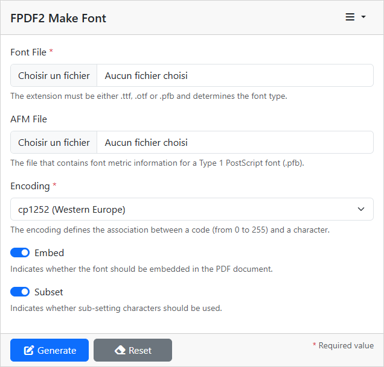

# FPDF2 Make Font UI

This plugin uses the
[FPDF2 Make Font](https://github.com/laurentmuller/fpdf2-make-font) library to
generate fonts.

## User interface

Light and dark themes are available.

## Fields

- `Font File`: The path to the `.ttf`, `.otf` or `.pfb` file.
- `AFM File`: The file that contains font metric information for a Type 1
  PostScript font (`.pfb`).
- `encoding`: The name of the encoding to use.
- `Embed`: Whether to embed the font or not.
- `Subset`: Whether to subset the font or not.

The `Font File` parameter is the name of the font file. The extension must be
either `.ttf`, `.otf` or `.pfb` and determines the font type. If your Type1 font
is in ASCII format (`.pfa`), you can convert it to binary (`.pfb`) with the help
of [Type 1 utilities](http://www.lcdf.org/~eddietwo/type/#t1utils). For Type1
fonts, the corresponding `.afm` file must be selected.

The `Encoding` defines the association between a code (from 0 to 255) and a
character. The first 128 are always the same and correspond to ASCII; the
following are variable. The available encoding ones are:

- cp1250 (Central Europe)
- cp1251 (Cyrillic)
- cp1252 (Western Europe)
- cp1253 (Greek)
- cp1254 (Turkish)
- cp1255 (Hebrew)
- cp1257 (Baltic)
- cp1258 (Vietnamese)
- cp874 (Thai)
- ISO-8859-1 (Western Europe)
- ISO-8859-2 (Central Europe)
- ISO-8859-4 (Baltic)
- ISO-8859-5 (Cyrillic)
- ISO-8859-7 (Greek)
- ISO-8859-9 (Turkish)
- ISO-8859-11 (Thai)
- ISO-8859-15 (Western Europe)
- ISO-8859-16 (Central Europe)
- KOI8-R (Russian)
- KOI8-U (Ukrainian)

Of course, the font must contain the characters corresponding to the selected
encoding.

The `Embed` parameter indicates whether the font should be embedded in the PDF
or not. When a font is not embedded, it is searched in the system. The advantage
is that the PDF file is smaller; but if it is not available, then a
substitution font is used. So you should ensure that the required font is
installed on the client systems. Embedding is the recommended option to
guarantee a correct rendering.

The `Subset` parameter indicates whether sub-setting should be used, that is to
say, whether only the characters from the selected encoding should be kept in
the embedded font. As a result, the size of the PDF file can be greatly reduced,
especially if the original font was big.

On the top right user can select the language (English or French), the
[site color mode](https://getbootstrap.com/docs/5.3/customize/color-modes/) and
have access to the source code on GitHub.

## Versions

## Code Quality

## Actions

